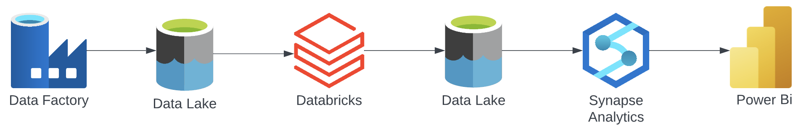

# E-commerce-azure-databricks
## Introduction
In this project, we will be using some ETL, analytics, and BI tools on Microsoft Azure cloud in the company of Databricks and Power Bi. We will use the E-Commerce Public Dataset by Olist to create a relational database for analysis.
#### ARCHITECTURE

